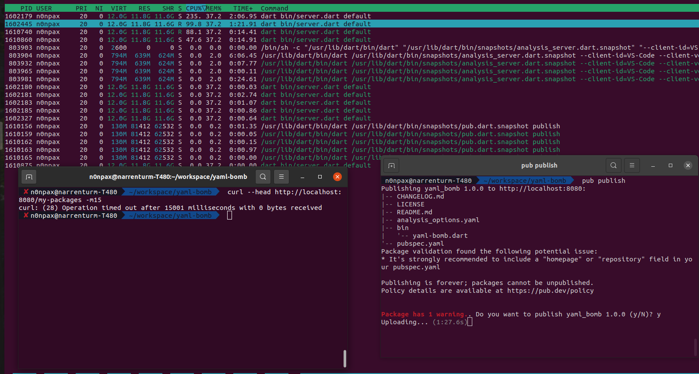
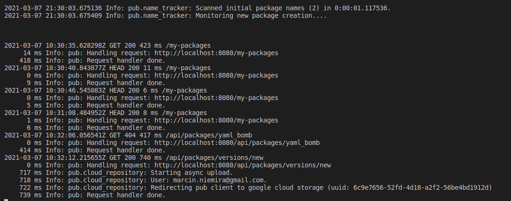
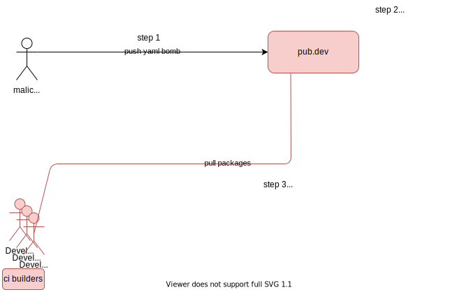

# Given README.md is just extended copy of Report provided to google

Report was rewarded with $500 bug bounty: https://issuetracker.google.com/issues/182062672

---

# pub.dev DoS vulnerability 

Looks like https://pub.dev/ (https://github.com/dart-lang/pub-dev) is a subject to DoS attack.

Please consider a `pubspec.yaml` which contains a YAML bomb. Once `pub publish` is executed, the application is published to `pub` packages registry.
The `pub.dev` registry(google owned app engine) code is trying to load `yaml` & `cpu` utilization is killing performance. The CPU is going to the sky and the website is not responsive anymore.

## Testing:

### Server

Spin up the server:
Edit `/app/lib/shared/configuration.dart` to change `gcp` project to one you own and run:

```bash
dart bin/server.dart default
```

### Client

go to `yaml-bomb` and run:
```bash
export PUB_HOSTED_URL=http://localhost:8080  
pub publish
```

### Observations:

1. CPU is going to the sky
2. `pub.dev` is not responsive anymore ~> timeout ~> DoS

Please refer to screenshots

---

# additional resources

In addition to the report following images were shared:






